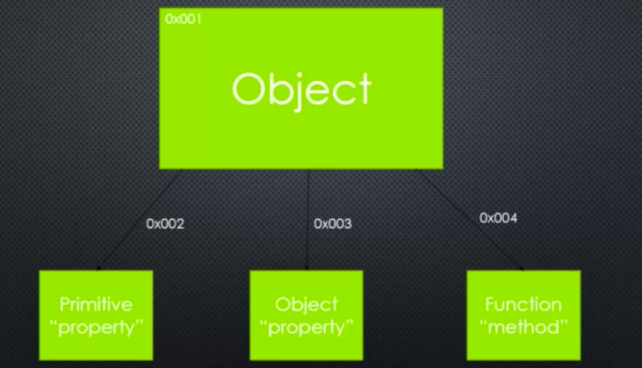
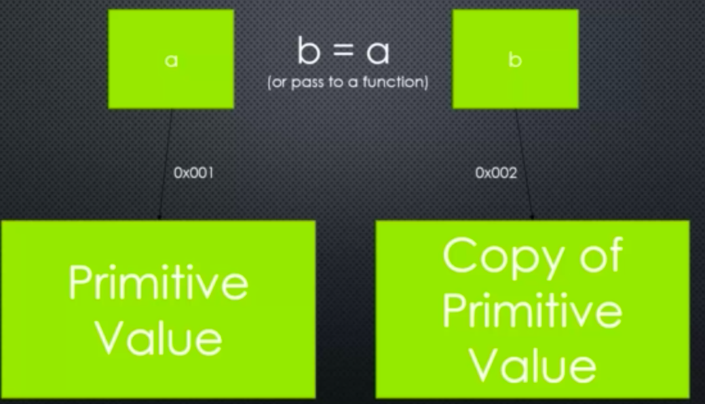
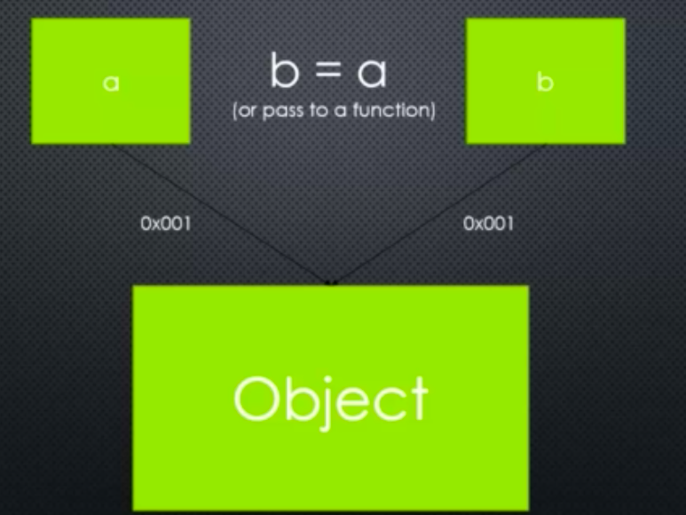

# Modules, Exports, and Require

## Conceptual Aside: Modules

Module: A reusable block of code whose existence does not accidently impact other code

### CommonJS Modules
An agreed upon standard for how code modules should be structured

## JavaScript Aside: First-Class Functions and Function Expressions

### First Class Functions 
Everything you can do with other types, you can do with functions
You can use functions like strings, numbers, etc (i.e pass them around, set variables equal to them, put them in arrays and more). 

### An Expression
A block of code that results in a value. Function expressions are possible in JavaScript because functions are first-class

## Let's build a module

Module is **self-contained** ie. the variables and functions outside it cannot be accessed by another file unless explicitly specified in module.exports

## JavaScript Aside: Object and Object Literals

### Name/Value Pair:
A name which maps to a value.\
The name may be defined more than once, but only can have one value in any given **context**
That value may be more name/value pairs.

Object: A collection of name/value pairs

An object can have primitive values like numbers and strings\
An object can have object like name value pairs\
An object can have a function. (Function is object in JS). When function is attached to object we call it a method\

### Object Literal
Name/value pairs separated by commas and surrounded by curly braces
We can create large object using object literals

Eg: {
    Street: 'Main',
    Number: 100,
    Apartment: 
    {
        Floor: 3,
        Number: 301
    }
}

## JavaScript Aside: Prototypal Inheritance and Function Constructors
 
 ### Inheritance
 One object gets access to the properties and methods of another object.

### Function constructors
A normal function that is used to constuct objects.
The 'this' keyword points a new empty object, and that object is returned from the function automatically. And we can do this by using the 'new' keyword

## JavaScript Aside: By Reference and By Value

### Primitive
A type of data that represents a single value. Like a number, string,etc. In other words, not an object. 

### Passing by value

Here, a is passed by value and hence b contains a copy of that value.

### Passing by reference

When we pass an object to a function, it is passed by reference ie. the object address is passed to the function (no new copy is made). 2 variables point now to the same location in memory. When you change one, you change the original value. 

In JavaScript, primitive values are passed by values (copied), and objects are passed by reference (points to same location)

### Immediately invoked function expressions (IIFE)
